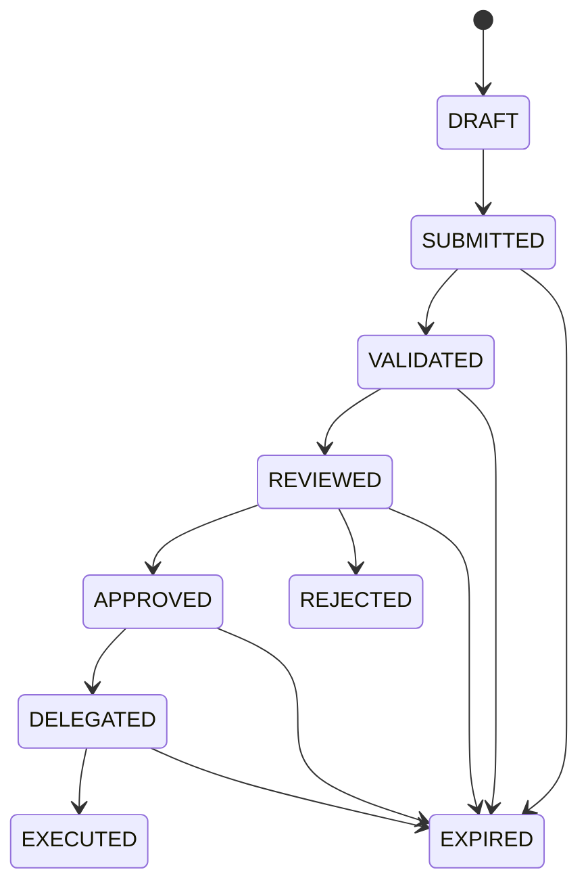

# Self-Service Proposal Lifecycle (Phase 15 Part 2 — Design)

This document defines the **proposal lifecycle** for controlled self-service.
It is **design-only** and does not introduce execution tooling.

## State machine

## State definitions

- **DRAFT**: Tenant prepares a proposal locally (not yet submitted).
- **SUBMITTED**: Proposal is immutable and queued for validation.
- **VALIDATED**: Schema and policy checks passed (read-only).
- **REVIEWED**: Operator reviewed diff/impact and evidence bundle.
- **APPROVED**: Operator approval artifact exists with explicit scope/constraints.
- **DELEGATED**: Time-bound delegation exists for operator execution paths.
- **EXECUTED**: Change applied (future phase; not implemented here).
- **REJECTED**: Terminal rejection by operator.
- **EXPIRED**: Terminal expiry after time window closes.

## Rules

- State transitions are **one-way**.
- Every transition requires evidence artifacts.
- Tenants can only move proposals from **DRAFT → SUBMITTED**.
- Operators control transitions **REVIEWED and above**.
- Execution can only occur after **APPROVED + DELEGATED**.

## Evidence requirements (summary)

- **SUBMITTED**: proposal.yml + checksum
- **VALIDATED**: validation.json
- **REVIEWED**: diff.md + impact.json + plan.json
- **APPROVED**: approval.yml (+ signature in prod)
- **DELEGATED**: delegation.yml
- **EXECUTED**: execution evidence (future phase)

See also:
- `docs/selfservice/audit-model.md`
- `docs/selfservice/execution-mapping.md`
