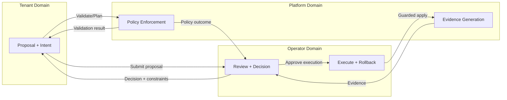

# Self-Service Trust Boundaries (Phase 15 Part 4 — Design)

This document defines explicit trust boundaries between tenants, operators, and
platform systems. It is design-only and enforces proposal-only behavior.

## Trust domains

### Tenant domain

- Identity and intent
- Proposals and supporting rationale

### Operator domain

- Approval and rejection decisions
- Execution and rollback actions

### Platform domain

- Policy enforcement
- Evidence generation
- Invariant protection

## Boundary rules

Information that flows up:
- Tenant intent and proposal details
- Validation outputs and evidence summaries

Decisions that flow down:
- Approval/rejection with rationale
- Required constraints or change windows

Actions that never cross boundaries:
- Tenants never execute changes.
- Operators never bypass platform policy.
- Platform never auto-approves for operators.

## Boundary diagram (Mermaid)

